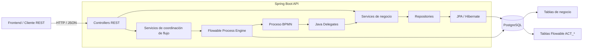

# MapuEscuela

Sistema de gestión de ventas para MapuEscuela.

El backend implementa servicios REST para cubrir el flujo principal del MVP: catálogo de productos, carrito de compras, checkout, generación de pedidos, comprobantes de pago, revisión del pago, actualización de inventario, preparación, retiro o despacho y finalización del pedido.

---

## Tecnologías

- Java 21
- Spring Boot
- Spring Web
- Spring Data JPA
- Hibernate
- Jakarta Validation
- PostgreSQL
- Docker
- Flowable
- Maven

---

## Arquitectura de la API REST

La parte backend de MapuEscuela utiliza una arquitectura por capas y un motor BPMN embebido. El objetivo es separar la exposición HTTP, la lógica de negocio, la persistencia y la orquestación del proceso de venta.



### Responsabilidad de los componentes

- **Controllers REST:** reciben solicitudes HTTP y exponen la API.
- **Services:** implementan las reglas y operaciones de negocio.
- **Servicios de coordinación de flujo:** completan tareas humanas de Flowable desde acciones de la API.
- **Flowable:** ejecuta el proceso BPMN de venta, incluidos User Tasks, Service Tasks, gateways y temporizadores.
- **Java Delegates:** conectan los Service Tasks del BPMN con los servicios Spring.
- **Repositories + JPA/Hibernate:** administran la persistencia del dominio.
- **PostgreSQL:** almacena tanto los datos de negocio como las tablas internas de Flowable.

La arquitectura completa de MapuEscuela puede incluir otros componentes desarrollados por integrantes del equipo. Este diagrama representa exclusivamente la API REST y la integración Spring Boot + Flowable + PostgreSQL implementada en este módulo.

---

# API REST

## URL base

Durante el desarrollo local, el backend se ejecuta por defecto en:

```text
http://localhost:8080
```

La URL base local de la API es:

```text
http://localhost:8080/api
```

`localhost` es solamente el valor de desarrollo. La conexión a PostgreSQL, el puerto HTTP y el plazo del comprobante pueden configurarse mediante variables de entorno sin modificar el código fuente.

Variables soportadas:

| Variable | Valor por defecto | Descripción |
|---|---|---|
| `DB_URL` | `jdbc:postgresql://localhost:5432/mapuescuela` | URL JDBC de PostgreSQL |
| `DB_USERNAME` | `mapuescuela` | Usuario de PostgreSQL |
| `DB_PASSWORD` | `mapuescuela_dev` | Contraseña de desarrollo |
| `SERVER_PORT` | `8080` | Puerto HTTP de la API |
| `JPA_DDL_AUTO` | `update` | Estrategia de Hibernate |
| `FLOWABLE_DATABASE_SCHEMA_UPDATE` | `true` | Actualización del esquema Flowable |
| `PLAZO_COMPROBANTE` | `PT24H` | Tiempo máximo para adjuntar comprobante |

Ejemplos locales:

```text
http://localhost:8080/api/productos
http://localhost:8080/api/carritos
http://localhost:8080/api/pedidos
http://localhost:8080/api/despachos
```

## Puesta en marcha

1. Iniciar PostgreSQL:

```bash
docker compose up -d
```

2. Compilar la aplicación:

```bash
mvn clean package
```

3. Ejecutar con Maven:

```bash
mvn spring-boot:run
```

o ejecutar el JAR generado:

```bash
java -jar target/mapuescuela-0.0.1-SNAPSHOT.jar
```

El proceso BPMN ejecutable se despliega automáticamente desde:

```text
src/main/resources/processes/procesoVentaMapuescuela.bpmn20.xml
```

---

# Clientes

Actualmente no existe una entidad ni un endpoint independiente `/api/clientes`.

Los datos del cliente se registran al realizar el checkout del carrito o al crear un pedido directamente.

El flujo recomendado para el frontend es realizar el checkout del carrito:

```http
POST /api/carritos/{carritoId}/checkout
```

## Body

```json
{
  "nombreCliente": "Pablo Pérez",
  "emailCliente": "pablo@example.com",
  "telefonoCliente": "+56912345678",
  "direccionDespacho": "Av. Siempre Viva 124",
  "modalidadEntrega": "DESPACHO"
}
```

Campos esperados:

| Campo | Tipo | Obligatorio | Validación |
|---|---|---:|---|
| `nombreCliente` | String | Sí | Máximo 120 caracteres |
| `emailCliente` | String | Sí | Email válido, máximo 150 |
| `telefonoCliente` | String | Sí | Máximo 30 caracteres |
| `direccionDespacho` | String | No | Máximo 300 caracteres |
| `modalidadEntrega` | Enum | Sí | `RETIRO` o `DESPACHO` |

El checkout utiliza automáticamente los productos almacenados en el carrito.

---

# Productos

Permiten administrar el catálogo de productos disponibles.

| Método | Ruta | Descripción |
|---|---|---|
| POST | `/api/productos` | Crear producto |
| GET | `/api/productos` | Listar productos |
| GET | `/api/productos/{id}` | Buscar producto por ID |
| GET | `/api/productos/disponibles` | Listar productos activos con stock |
| PUT | `/api/productos/{id}` | Actualizar producto |
| DELETE | `/api/productos/{id}` | Eliminar producto |

## Crear producto

```http
POST /api/productos
```

### Body

```json
{
  "nombre": "Harry Potter",
  "descripcion": "Libro usado en buen estado",
  "categoria": "Libros",
  "precio": 5000,
  "fotoUrl": "https://ejemplo.com/harry.jpg",
  "stock": 3
}
```

### Respuesta esperada

```http
201 Created
```

Ejemplo:

```json
{
  "id": 4,
  "nombre": "Harry Potter",
  "descripcion": "Libro usado en buen estado",
  "categoria": "Libros",
  "precio": 5000.00,
  "fotoUrl": "https://ejemplo.com/harry.jpg",
  "stock": 3,
  "estado": "ACTIVO",
  "version": 0
}
```

---

# Carrito de compras

Permite crear un carrito, agregar productos, modificar cantidades, eliminar productos y convertirlo en un pedido.

| Método | Ruta | Descripción |
|---|---|---|
| POST | `/api/carritos` | Crear carrito vacío |
| GET | `/api/carritos` | Listar carritos |
| GET | `/api/carritos/{id}` | Consultar carrito |
| GET | `/api/carritos/estado/{estado}` | Listar por estado |
| POST | `/api/carritos/{id}/items` | Agregar producto |
| PUT | `/api/carritos/{id}/items/{productoId}` | Actualizar cantidad |
| DELETE | `/api/carritos/{id}/items/{productoId}` | Eliminar producto |
| DELETE | `/api/carritos/{id}/items` | Vaciar carrito |
| POST | `/api/carritos/{id}/checkout` | Convertir carrito en pedido |

Estados:

```text
ACTIVO
CONVERTIDO_EN_PEDIDO
CANCELADO
```

## Crear carrito

```http
POST /api/carritos
```

No requiere body.

### Respuesta esperada

```http
201 Created
```

```json
{
  "id": 1,
  "codigo": "CAR-AB12CD34",
  "estado": "ACTIVO",
  "fechaCreacion": "2026-09-16T12:00:00",
  "total": 0,
  "items": []
}
```

---

## Agregar producto al carrito

```http
POST /api/carritos/{carritoId}/items
```

### Body

```json
{
  "productoId": 4,
  "cantidad": 2
}
```

### Respuesta esperada

```http
200 OK
```

```json
{
  "id": 1,
  "codigo": "CAR-AB12CD34",
  "estado": "ACTIVO",
  "fechaCreacion": "2026-09-16T12:00:00",
  "total": 2000.00,
  "items": [
    {
      "id": 1,
      "productoId": 4,
      "nombreProducto": "Producto ejemplo",
      "cantidad": 2,
      "precioUnitario": 1000.00,
      "subtotal": 2000.00
    }
  ]
}
```

---

## Actualizar cantidad

```http
PUT /api/carritos/{carritoId}/items/{productoId}
```

### Body

```json
{
  "productoId": 4,
  "cantidad": 3
}
```

`cantidad` debe ser como mínimo `1`.

### Respuesta esperada

```http
200 OK
```

Devuelve el carrito completo con el total recalculado.

---

## Checkout del carrito

```http
POST /api/carritos/{carritoId}/checkout
```

### Body

```json
{
  "nombreCliente": "Pablo Pérez",
  "emailCliente": "pablo@example.com",
  "telefonoCliente": "+56912345678",
  "direccionDespacho": "Av. Siempre Viva 124",
  "modalidadEntrega": "DESPACHO"
}
```

### Comportamiento

```text
Carrito ACTIVO
      ↓
Checkout
      ↓
Pedido PENDIENTE_PAGO
      ↓
Carrito CONVERTIDO_EN_PEDIDO
```

### Respuesta esperada

```http
200 OK
```

Ejemplo:

```json
{
  "id": 5,
  "codigo": "PED-A1B2C3D4",
  "nombreCliente": "Pablo Pérez",
  "emailCliente": "pablo@example.com",
  "telefonoCliente": "+56912345678",
  "direccionDespacho": "Av. Siempre Viva 124",
  "modalidadEntrega": "DESPACHO",
  "estado": "PENDIENTE_PAGO",
  "total": 2000.00,
  "fechaCreacion": "2026-09-16T12:10:00",
  "detalles": [
    {
      "id": 8,
      "productoId": 4,
      "nombreProducto": "Producto ejemplo",
      "cantidad": 2,
      "precioUnitario": 1000.00,
      "subtotal": 2000.00
    }
  ]
}
```

---

# Pedidos

Permiten administrar los pedidos.

| Método | Ruta | Descripción |
|---|---|---|
| POST | `/api/pedidos` | Crear pedido directamente |
| GET | `/api/pedidos` | Listar pedidos |
| GET | `/api/pedidos/{id}` | Buscar por ID |
| GET | `/api/pedidos/codigo/{codigo}` | Buscar por código |
| GET | `/api/pedidos/estado/{estado}` | Listar por estado |
| PUT | `/api/pedidos/{id}` | Actualizar pedido |
| DELETE | `/api/pedidos/{id}` | Eliminar pedido |

> Para el flujo normal del MVP se recomienda crear el pedido mediante el checkout del carrito.

## Crear pedido directamente

```http
POST /api/pedidos
```

### Body

```json
{
  "nombreCliente": "Pablo Pérez",
  "emailCliente": "pablo@example.com",
  "telefonoCliente": "+56912345678",
  "direccionDespacho": "Av. Siempre Viva 124",
  "modalidadEntrega": "DESPACHO",
  "detalles": [
    {
      "productoId": 4,
      "cantidad": 2
    }
  ]
}
```

### Respuesta esperada

```http
201 Created
```

El pedido queda inicialmente en:

```text
PENDIENTE_PAGO
```

Ejemplo:

```json
{
  "id": 5,
  "codigo": "PED-A1B2C3D4",
  "nombreCliente": "Pablo Pérez",
  "emailCliente": "pablo@example.com",
  "telefonoCliente": "+56912345678",
  "direccionDespacho": "Av. Siempre Viva 124",
  "modalidadEntrega": "DESPACHO",
  "estado": "PENDIENTE_PAGO",
  "total": 2000.00,
  "fechaCreacion": "2026-09-16T12:10:00",
  "detalles": [
    {
      "id": 8,
      "productoId": 4,
      "nombreProducto": "Producto ejemplo",
      "cantidad": 2,
      "precioUnitario": 1000.00,
      "subtotal": 2000.00
    }
  ]
}
```

---

# Comprobante de pago

Permite registrar y consultar el comprobante asociado a un pedido.

| Método | Ruta | Descripción |
|---|---|---|
| POST | `/api/pedidos/{pedidoId}/comprobante` | Registrar comprobante |
| GET | `/api/pedidos/{pedidoId}/comprobante` | Consultar comprobante |

## Registrar comprobante

```http
POST /api/pedidos/{pedidoId}/comprobante
```

El pedido debe encontrarse en:

```text
PENDIENTE_PAGO
```

### Body

```json
{
  "nombreArchivo": "comprobante-pedido-5.jpg",
  "rutaArchivo": "https://ejemplo.com/comprobantes/comprobante-pedido-5.jpg",
  "observacion": "Transferencia realizada por el cliente"
}
```

Campos:

| Campo | Obligatorio | Restricción |
|---|---:|---|
| `nombreArchivo` | Sí | Máximo 255 caracteres |
| `rutaArchivo` | Sí | Máximo 500 caracteres |
| `observacion` | No | Máximo 1000 caracteres |

### Respuesta esperada

```http
201 Created
```

```json
{
  "id": 1,
  "pedidoId": 5,
  "codigoPedido": "PED-A1B2C3D4",
  "nombreArchivo": "comprobante-pedido-5.jpg",
  "rutaArchivo": "https://ejemplo.com/comprobantes/comprobante-pedido-5.jpg",
  "fechaCarga": "2026-09-16T12:20:00",
  "decision": "PENDIENTE",
  "observacion": "Transferencia realizada por el cliente"
}
```

Después de esta operación:

```text
Pedido:
PENDIENTE_PAGO → PAGO_EN_REVISION

Comprobante:
PENDIENTE
```

---

# Revisión del pago

La aprobación y el rechazo se coordinan mediante Flowable. El controller entrega la decisión al proceso y el gateway BPMN decide la ruta.

## Aprobar pago

```http
POST /api/pedidos/{pedidoId}/pago/aprobar
```

No requiere body.

### Respuesta esperada

```http
204 No Content
```

Flowable registra:

```text
pagoAprobado = true
```

y ejecuta la lógica automática que:

```text
PAGO_EN_REVISION
      ↓
Aprobar comprobante
      ↓
Descontar stock
      ↓
PAGO_APROBADO
      ↓
Iniciar preparación
      ↓
EN_PREPARACION
      ↓
Task_PrepararPedido
```

Si el stock de un producto llega a `0`, el producto queda en estado `AGOTADO`.

---

## Rechazar pago

```http
POST /api/pedidos/{pedidoId}/pago/rechazar
```

No requiere body.

### Respuesta esperada

```http
204 No Content
```

Flowable registra:

```text
pagoAprobado = false
```

El comprobante queda `RECHAZADO`, el pedido queda en `PAGO_RECHAZADO` y la instancia termina.

Al rechazar un pago **no se descuenta stock**.

---

# Preparación del pedido

La preparación se inicia automáticamente desde Flowable después de aprobar el pago.

```text
PAGO_APROBADO
      ↓
IniciarPreparacionDelegate
      ↓
EN_PREPARACION
      ↓
Task_PrepararPedido
```

Cuando el voluntario termina de preparar el pedido se completa la tarea humana mediante:

```http
POST /api/pedidos/{pedidoId}/preparacion/completar
```

No requiere body.

### Respuesta esperada

```http
204 No Content
```

Flowable evalúa la variable:

```text
modalidadEntrega
```

y continúa automáticamente por `RETIRO` o `DESPACHO`.

---

# Retiro

Para pedidos con:

```text
modalidadEntrega = RETIRO
```

al completar `Task_PrepararPedido`, Flowable ejecuta automáticamente el delegate que cambia el estado:

```text
EN_PREPARACION
      ↓
LISTO_PARA_RETIRO
      ↓
Task_RegistrarRetiro
```

Cuando el cliente retira el pedido se utiliza:

```http
POST /api/pedidos/{pedidoId}/retiro/confirmar
```

No requiere body.

### Respuesta esperada

```http
204 No Content
```

Al completar `Task_RegistrarRetiro`, Flowable ejecuta `FinalizarPedidoDelegate`, cambia el pedido a `FINALIZADO` y termina la instancia.

---

# Despachos

Para pedidos con modalidad:

```text
DESPACHO
```

Flowable dirige el proceso desde `Task_PrepararPedido` hacia:

```text
Task_RegistrarDespacho
```

## Endpoints

| Método | Ruta | Descripción |
|---|---|---|
| GET | `/api/despachos` | Listar despachos |
| GET | `/api/despachos/{id}` | Consultar despacho por ID |
| GET | `/api/despachos/pedido/{pedidoId}` | Consultar despacho asociado a un pedido |
| POST | `/api/despachos` | Registrar despacho |
| PUT | `/api/despachos/{id}` | Actualizar despacho |
| POST | `/api/despachos/pedidos/{pedidoId}/confirmar-entrega` | Confirmar entrega del pedido |

## Registrar despacho

```http
POST /api/despachos
```

El pedido debe cumplir:

```text
modalidadEntrega = DESPACHO
estado = EN_PREPARACION
```

### Body para COURIER

```json
{
  "pedidoId": 10,
  "tipo": "COURIER",
  "empresaTransporte": "Chileexpress",
  "numeroSeguimiento": "CHX-12345678",
  "fechaEnvio": "2026-09-21"
}
```

Para:

```text
tipo = COURIER
```

son obligatorios:

```text
empresaTransporte
numeroSeguimiento
```

### Body para VOLUNTARIO

```json
{
  "pedidoId": 10,
  "tipo": "VOLUNTARIO",
  "empresaTransporte": null,
  "numeroSeguimiento": null,
  "fechaEnvio": "2026-09-21"
}
```

Valores permitidos para `tipo`:

```text
COURIER
VOLUNTARIO
```

### Respuesta esperada

```http
201 Created
```

Ejemplo:

```json
{
  "id": 3,
  "pedidoId": 10,
  "codigoPedido": "PED-7219DFA1",
  "tipo": "COURIER",
  "empresaTransporte": "Chileexpress",
  "numeroSeguimiento": "CHX-12345678",
  "fechaEnvio": "2026-09-21"
}
```

Cuando el despacho se registra correctamente:

```text
Task_RegistrarDespacho
        ↓
Despacho persistido
        ↓
Pedido ENVIADO
        ↓
Task_ConfirmarEntrega
```

## Confirmar entrega

Cuando se confirma que el pedido fue entregado:

```http
POST /api/despachos/pedidos/{pedidoId}/confirmar-entrega
```

No requiere body.

### Respuesta esperada

```http
204 No Content
```

El endpoint ejecuta:

```text
EntregaFlujoService.confirmarEntrega()
        ↓
ProcesoVentaService
        ↓
completa Task_ConfirmarEntrega
        ↓
FinalizarPedidoDelegate
        ↓
Pedido FINALIZADO
        ↓
End Event
```

Con esto, la rama `DESPACHO` del proceso queda finalizada.

---

# Finalización del pedido

En el flujo BPMN normal, la finalización se ejecuta desde `FinalizarPedidoDelegate` después de completar la última tarea humana correspondiente:

```text
RETIRO:
Task_RegistrarRetiro
      ↓
FinalizarPedidoDelegate
      ↓
FINALIZADO

DESPACHO:
Task_ConfirmarEntrega
      ↓
FinalizarPedidoDelegate
      ↓
FINALIZADO
```

La instancia Flowable termina y deja de aparecer en `ACT_RU_TASK` y `ACT_RU_EXECUTION`; su información permanece disponible en las tablas históricas `ACT_HI_*`.

> Si el proyecto conserva endpoints directos de transición por compatibilidad con el frontend, estos deben considerarse operaciones heredadas. El flujo BPMN probado para la entrega utiliza la orquestación descrita anteriormente.

---

# Estados principales del pedido

```text
PENDIENTE_PAGO
PAGO_EN_REVISION
PAGO_RECHAZADO
PAGO_APROBADO
EN_PREPARACION
LISTO_PARA_RETIRO
ENVIADO
FINALIZADO
CANCELADO
```

---

# Flujo principal implementado

```text
Catálogo de productos
        ↓
Carrito ACTIVO
        ↓
Agregar productos
        ↓
Checkout
        ↓
Pedido PENDIENTE_PAGO
        ↓
Task_AdjuntarComprobante
   ├────────── vence plazo ──────────→ CANCELADO → Fin
   ↓
Registrar comprobante
        ↓
PAGO_EN_REVISION
        ↓
Task_RevisarComprobante
        ↓
    Gateway pago
      ┌────┴────┐
      ↓         ↓
 APROBADO    RECHAZADO
      ↓         ↓
Descontar     PAGO_RECHAZADO
 stock            ↓
      ↓           Fin
EN_PREPARACION
      ↓
Task_PrepararPedido
      ↓
Gateway modalidadEntrega
   ┌────────────┴────────────┐
   ↓                         ↓
RETIRO                    DESPACHO
   ↓                         ↓
LISTO_PARA_RETIRO      Task_RegistrarDespacho
   ↓                         ↓
Task_RegistrarRetiro       ENVIADO
   ↓                         ↓
   │                   Task_ConfirmarEntrega
   └─────────────┬───────────┘
                 ↓
        FinalizarPedidoDelegate
                 ↓
            FINALIZADO
                 ↓
                Fin
```

## Escenarios E2E comprobados

| Escenario | Resultado |
|---|---|
| Pago aprobado + `DESPACHO` | Pedido `FINALIZADO` |
| Pago aprobado + `RETIRO` | Pedido `FINALIZADO` |
| Pago rechazado | `PAGO_RECHAZADO` y proceso terminado |
| No adjuntar comprobante dentro del plazo | `CANCELADO` y proceso terminado |

---

# Manejo global de errores HTTP

La API implementa manejo centralizado de excepciones mediante `@RestControllerAdvice`.

Los códigos principales utilizados son:

| Código | Significado | Ejemplo |
|---:|---|---|
| `400 Bad Request` | Request o validación incorrecta | email inválido, cantidad menor a 1, enum inválido |
| `404 Not Found` | Recurso inexistente | producto, carrito, pedido, comprobante o despacho inexistente |
| `409 Conflict` | Regla de negocio incumplida | stock insuficiente, estado incorrecto, despacho duplicado |
| `500 Internal Server Error` | Error inesperado | error no controlado por la aplicación |

---

## Formato estándar de error

Los errores tienen la siguiente estructura:

```json
{
  "timestamp": "2026-09-16T12:30:15.123",
  "status": 409,
  "error": "Conflict",
  "message": "Descripción del error",
  "path": "/api/recurso",
  "validationErrors": null
}
```

---

## Ejemplo: recurso inexistente

```http
404 Not Found
```

```json
{
  "timestamp": "2026-09-16T12:30:15.123",
  "status": 404,
  "error": "Not Found",
  "message": "Pedido no encontrado: 999",
  "path": "/api/pedidos/999",
  "validationErrors": null
}
```

---

## Ejemplo: regla de negocio

Por ejemplo, intentar registrar un despacho para un pedido que no está en preparación:

```http
409 Conflict
```

```json
{
  "timestamp": "2026-09-16T12:30:15.123",
  "status": 409,
  "error": "Conflict",
  "message": "Solo se puede crear un despacho para pedidos en estado EN_PREPARACION",
  "path": "/api/despachos",
  "validationErrors": null
}
```

Otros casos que pueden producir `409 Conflict`:

```text
Stock insuficiente.
Producto no activo.
Carrito ya convertido en pedido.
Pedido en estado incorrecto.
Pedido ya tiene comprobante.
Comprobante ya revisado.
Pedido ya tiene despacho.
Pedido de modalidad RETIRO intentando registrar despacho.
COURIER sin empresa de transporte.
COURIER sin número de seguimiento.
```

---

## Ejemplo: errores de validación

```http
400 Bad Request
```

Ejemplo de body incorrecto:

```json
{
  "nombreCliente": "",
  "emailCliente": "",
  "telefonoCliente": "",
  "modalidadEntrega": "DESPACHO",
  "detalles": []
}
```

Respuesta:

```json
{
  "timestamp": "2026-09-16T12:30:15.123",
  "status": 400,
  "error": "Bad Request",
  "message": "Error de validación en la solicitud",
  "path": "/api/pedidos",
  "validationErrors": {
    "nombreCliente": "El nombre del cliente es obligatorio",
    "emailCliente": "El email del cliente es obligatorio",
    "telefonoCliente": "El teléfono del cliente es obligatorio",
    "detalles": "El pedido debe contener al menos un producto"
  }
}
```

---

## Ejemplo: enum inválido

Por ejemplo:

```json
{
  "modalidadEntrega": "ENVIO"
}
```

`ENVIO` no existe. Los valores permitidos son:

```text
RETIRO
DESPACHO
```

La API responde:

```http
400 Bad Request
```

con un formato similar a:

```json
{
  "timestamp": "2026-09-16T12:30:15.123",
  "status": 400,
  "error": "Bad Request",
  "message": "El cuerpo de la solicitud no es válido o contiene valores incorrectos",
  "path": "/api/pedidos",
  "validationErrors": null
}
```

---

# Resumen de endpoints para integración frontend

| Acción | Método | Ruta |
|---|---|---|
| Consultar productos disponibles | GET | `/api/productos/disponibles` |
| Crear carrito | POST | `/api/carritos` |
| Consultar carrito | GET | `/api/carritos/{id}` |
| Agregar producto | POST | `/api/carritos/{id}/items` |
| Modificar cantidad | PUT | `/api/carritos/{id}/items/{productoId}` |
| Eliminar producto | DELETE | `/api/carritos/{id}/items/{productoId}` |
| Realizar checkout e iniciar proceso Flowable | POST | `/api/carritos/{id}/checkout` |
| Consultar pedido | GET | `/api/pedidos/{id}` |
| Registrar comprobante | POST | `/api/pedidos/{id}/comprobante` |
| Consultar comprobante | GET | `/api/pedidos/{id}/comprobante` |
| Aprobar pago | POST | `/api/pedidos/{id}/pago/aprobar` |
| Rechazar pago | POST | `/api/pedidos/{id}/pago/rechazar` |
| Completar preparación | POST | `/api/pedidos/{id}/preparacion/completar` |
| Confirmar retiro | POST | `/api/pedidos/{id}/retiro/confirmar` |
| Registrar despacho | POST | `/api/despachos` |
| Listar despachos | GET | `/api/despachos` |
| Consultar despacho por pedido | GET | `/api/despachos/pedido/{pedidoId}` |
| Actualizar despacho | PUT | `/api/despachos/{id}` |
| Confirmar entrega de despacho | POST | `/api/despachos/pedidos/{pedidoId}/confirmar-entrega` |

---

# Base de datos

PostgreSQL se ejecuta mediante Docker Compose y almacena tanto la información del dominio como la información interna de Flowable.

Para iniciar PostgreSQL:

```bash
docker compose up -d
```

Acceso manual:

```bash
docker exec -it mapuescuela-postgres psql -U mapuescuela -d mapuescuela
```

## Verificación de datos del negocio

```sql
SELECT * FROM productos;
SELECT * FROM carritos;
SELECT * FROM items_carrito;
SELECT * FROM pedidos;
SELECT * FROM detalles_pedido;
SELECT * FROM comprobantes_pago;
SELECT * FROM despachos;
```

## Verificación de Flowable

Definiciones desplegadas:

```sql
SELECT * FROM act_re_procdef;
```

Tareas humanas activas:

```sql
SELECT id_, name_, task_def_key_, proc_inst_id_
FROM act_ru_task;
```

Variables activas:

```sql
SELECT proc_inst_id_, name_, type_, text_, long_
FROM act_ru_variable;
```

Timers activos:

```sql
SELECT process_instance_id_, element_id_, element_name_, duedate_
FROM act_ru_timer_job;
```

Historial de procesos:

```sql
SELECT proc_inst_id_, business_key_, start_time_, end_time_
FROM act_hi_procinst;
```

Cuando una instancia finaliza correctamente, deja de aparecer en `ACT_RU_TASK` y `ACT_RU_EXECUTION`, mientras que su historial permanece en `ACT_HI_*`.

---

# CORS

La API utiliza una configuración CORS global aplicada a:

```text
/api/**
```

Por lo tanto, los controladores no necesitan declarar `@CrossOrigin` individualmente.

Durante desarrollo deben configurarse explícitamente los orígenes correspondientes al frontend.

---

# BPMN

El proceso ejecutable utilizado por Flowable se encuentra en:

```text
src/main/resources/processes/procesoVentaMapuescuela.bpmn20.xml
```

Flowable se ejecuta embebido dentro de Spring Boot y utiliza PostgreSQL para persistir definiciones, instancias, tareas, variables, timers e historial.

El proceso incluye:

- User Tasks para comprobante, revisión, preparación, retiro y despacho.
- Service Tasks implementadas mediante `JavaDelegate`.
- Gateways exclusivos para aprobación del pago y modalidad de entrega.
- Boundary Timer interruptivo para el plazo del comprobante.
- Integración con los servicios Spring para actualizar el estado del dominio y el inventario.

El plazo del comprobante se configura externamente mediante:

```text
PLAZO_COMPROBANTE
```

con valor final por defecto:

```text
PT24H
```

---

# Alcance de esta documentación

Este README documenta principalmente la **API REST** desarrollada con Spring Boot, Flowable y PostgreSQL.

El diagrama presentado corresponde únicamente a este componente de la solución MapuEscuela. Para el diagrama de arquitectura general de la entrega final será necesario incorporar los módulos desarrollados por los demás integrantes del equipo y mostrar cómo se integran con esta API.
